# Ecoplast Hart SRL — Knowledge Graph

> Portable knowledge pack about the company behind this website project.
> Paste any section of this file into another chat as context.
> Compiled 2026-09-01 from the project source (bilingual RO/EN marketing copy in `/constants`)
> plus public Romanian trade-registry aggregators. See **Sources & confidence** at the end.

---

## 1. One-paragraph summary

**Ecoplast Hart SRL** (S.C. Ecoplast Hart S.R.L.) is a Romanian waste-management and
recycling company founded on **20 December 2004**, based in **Hunedoara county**, with its
operational yard at **Sat Cristur, Șos. Hunedoarei nr. 13 (municipality of Deva)**. Its core
business (CAEN **3832**) is the **collection, sorting and recycling of sorted recyclable
materials** — both non-hazardous and hazardous, non-metallic (cardboard, paper, plastic,
rubber, glass, wood, textile/leather) and metallic (ferrous and non-ferrous). It runs its
own **cable-processing facility** that outputs copper/aluminium granules and plastic
fractions as secondary raw materials, operates a **truck-and-container logistics fleet**, and
**equips its client partners on-site** with mills, containers and big bags for selective
collection. The company positions itself around **EU waste-hierarchy compliance** and a
self-funded growth model (reinvesting profit into processing capacity). Turnover has run at
roughly **13 million RON (~€2.5M) per year** with ~17–24 employees. The website claims a
presence in **Romania, Hungary and Moldova** and holds (per its own site) **ISO 9001, ISO
14001 and ISO 45001** certifications.

---

## 2. Entity–relation graph

```mermaid
graph TD
    EH["Ecoplast Hart SRL<br/>CUI 17059959 · J20/1943/2004 · est. 2004-12-20<br/>CAEN 3832 · ecoplasthart.com"]

    EH -->|registered office| RO_OFF["B-dul Dacia nr. 2, Bl. E5, ap. 1<br/>Municipiul Hunedoara"]
    EH -->|operational site| CRISTUR["Punct de lucru Cristur<br/>Șos. Hunedoarei nr. 13, Sat Cristur, Deva<br/>secondary CUI 35287696 · opened 2015"]
    EH -->|contact| CT["ecoplast_hart@yahoo.com<br/>+40 746 152 318 · 0254 746515"]

    EH -->|positioning| POS["Collection · Sorting · Recycling<br/>EU waste hierarchy · generator→collector→recovery<br/>self-funded growth · 19+ yrs experience"]
    EH -->|claimed markets| MK["Romania (confirmed)<br/>Hungary · Moldova (website claim only)"]
    EH -->|claimed certifications| CERT["ISO 9001:2015 (Quality)<br/>ISO 14001:2015 (Environment)<br/>ISO 45001:2018 (OH&S)"]

    EH -->|capabilities| CAP
    subgraph CAP["Capabilities"]
        C1["Waste collection<br/>+ transport across Romania"]
        C2["Sorting mill / recycling lines"]
        C3["Compaction & baling<br/>(cardboard, plastic)"]
        C4["Cable processing facility<br/>→ Cu/Al granules + plastic fractions"]
        C5["On-site partner equipping<br/>(mills, containers, big bags)"]
        C6["Logistics fleet<br/>roll-off trucks (Abrollkipper),<br/>dump trucks, containers, grab crane"]
    end

    EH -->|handles waste streams| WS
    subgraph WS["Waste streams"]
        W1["Plastic (PET, film, crates, trays, conduit)"]
        W2["Paper & cardboard"]
        W3["Wood"]
        W4["Textile & leather"]
        W5["Ferrous metals"]
        W6["Non-ferrous (Al, Cu, brass, Pb, Ni, Zn)"]
        W7["WEEE / DEEE"]
        W8["Glass"]
        W9["Rubber"]
        W10["Used batteries & accumulators"]
        W11["Hazardous waste"]
        W12["Used / mineral oils"]
        W13["Cables (Al/Cu conductors)"]
    end

    C4 --> W13
    C4 --> W6
    C5 --> C1
    CRISTUR --> C2
    CRISTUR --> C3
    CRISTUR --> C4
```

---

## 3. Company identity (registry data — high confidence)

| Field | Value |
|---|---|
| Legal name | Ecoplast Hart SRL (S.C. Ecoplast Hart S.R.L.) |
| Legal form | SRL — limited liability company |
| CUI / fiscal code | **17059959** |
| Trade register no. | **J20/1943/2004** (J20 = Hunedoara county) |
| Founded | **20 December 2004** |
| Principal activity | CAEN **3832** — *Recuperarea materialelor reciclabile sortate* (Recovery of sorted recyclable materials) |
| VAT | Registered VAT payer; no ANAF (tax authority) debts reported |
| Status | Active |
| Registered office | B-dul Dacia nr. 2, Bl. E5, et. P, ap. 1, Municipiul Hunedoara, jud. Hunedoara (~331025) |
| Operational site | Șos. Hunedoarei nr. 13, Sat Cristur, Deva, jud. Hunedoara (work point, secondary CUI 35287696, opened 3 Dec 2015) |
| Website | https://www.ecoplasthart.com/ (bilingual RO/EN) |
| Contact | ecoplast_hart@yahoo.com · +40 746 152 318 · 0254 746515 · 0254 236228 |

> Note: "Cristur" is a village that administratively belongs to the **municipality of Deva**
> (the county seat), roughly between Deva and Hunedoara. The website footer gives the Cristur
> address as the company address; the trade registry lists the Hunedoara flat as the legal seat.

---

## 4. What the company does

**Positioning (from the site copy):**
- "At ECOPLAST HART we specialize in the collection, sorting, and recycling of all types of waste materials."
- Object of activity: recovery of sorted recyclable materials; storage of non-hazardous and hazardous waste; wholesale trade of waste and scrap.
- Frames itself as "a dedicated team of eco-warriors," a "fast-growing company … in multiple countries."
- Emphasises **full compliance with EU waste-management policy** and the **generator → collector → recovery** circuit.
- Runs **awareness campaigns** to shift public mentality toward recycling and to apply EU legislation/work procedures.
- Growth model: **self-funded**, continuously reinvesting profit into processing facilities, logistics parks and qualified personnel.
- Website shows **"19+ years" of experience** (baseline ~2023).

**Operational capabilities:**
| Capability | Detail |
|---|---|
| Collection | At the client's generation site and at the yard; transport of non-hazardous waste throughout Romania. |
| Partner equipping | Supplies partners with mills (volume reduction), collection containers and big bags for selective collection. |
| Sorting | Sorting mill; recycling lines made of function-specific equipment. |
| Compaction / baling | Mills plus compaction & processing facilities for **cardboard** and **plastic**. |
| Cable processing | Dedicated facility recycling Al/Cu cables (overhead, underground, automotive, electronics) → **copper granules, aluminium granules, plastic fractions** = secondary raw materials. |
| Non-ferrous treatment | Aluminium, copper, lead, nickel, zinc; brass alloys; mixed alloys containing silver/gold/platinum/rare metals. |
| Logistics fleet | Roll-off trucks ("Abrollkipper"), large- and small-tonnage dump trucks, containers, grab/material-handler crane ("greifer"). |

**Waste streams handled:** plastic (PET, film/foil, crates, trays, conduit, plastic-with-metal), paper & cardboard, wood, textile & leather, ferrous metals, non-ferrous metals, WEEE/DEEE, glass, rubber, used batteries & accumulators, hazardous waste, used/mineral oils, cables.

---

## 5. Markets & certifications

**Geographic presence:**
- **Confirmed:** Romania — Hunedoara county (Cristur/Deva and Hunedoara; collection points also referenced around Deva).
- **Website claim only:** operations across **Romania, Hungary and the Republic of Moldova** ("Global Reach, Local Impact"). No foreign branches appear in the Romanian trade registry — treat as marketing/aspirational.

**Certifications (claimed on company website; certificate numbers not independently verified):**
- **ISO 9001:2015** — Quality Management System
- **ISO 14001:2015** — Environmental Management System
- **ISO 45001:2018** — Occupational Health & Safety Management System

---

## 6. Financials & headcount (approximate)

Turnover ≈ **13M RON/year (~€2.5M)**. Figures vary by source and reporting year; treat as indicative.

| Year | Turnover | Net profit | Employees |
|---|---|---|---|
| 2018 | 11.78M RON | 0.43M RON | 17 |
| 2019 | 11.26M RON | 0.26M RON | 18 |
| 2020 | 12.87M RON | 0.23M RON | 17 |
| 2021 | 13.43M RON | 0.68M RON | 19 |
| 2022 | ~€2.36M | ~€0.09M | 18 |
| 2023 | ~€2.58M | ~€0.05M | 18 |
| 2024 | 13.20M RON | 0.75M RON | 4–22 (sources disagree) |
| 2025 | 13.14M RON | 0.74M RON | 5–24 (sources disagree) |

- Ownership: **1 sole associate + 1 administrator** (names not public without a paid registry account).
- Employee counts for 2024–2025 are contradictory between aggregators; the higher figure (~22–24) is more consistent with the turnover level.

---

## 7. The website project (this repository)

- **Stack:** Next.js (App Router) + TypeScript, SCSS modules, Tailwind, Framer Motion; deployed via GitHub Pages workflow / Vercel-style build.
- **Structure:** single-page marketing site — Hero → About us → "Why choose us" → "What we do" (waste categories) → Footer.
- **Bilingual:** RO/EN toggled via `LanguageSelectorContext`; all copy lives in `/constants/*.tsx`.
- **Interactive Europe map** (`svgs/EuropeMap`) highlighting Romania (RO), Hungary (HU), Moldova (MD).
- Metadata still contains the default `"Create Next App"` title (not yet customised).
- Contact in footer: `ecoplast_hart@yahoo.com`, `+40746152318`, "Sat Cristur, Strada Hunedoarei nr. 13, Jud. Hunedoara".

---

## 8. Sources & confidence

**Primary (this repo):** `constants/AboutUsSectionOne.tsx`, `AboutUsSectionThree.tsx`, `AboutUsSectionFour.tsx`, `WhyUsTexts.tsx`, `WhatWeDo.tsx`, `Footer.tsx`, `Herobox.tsx`, `WasteCategories.tsx`.

**External:**
- Live site — https://www.ecoplasthart.com/
- termene.ro — https://termene.ro/firma/17059959-ECOPLAST-HART-SRL
- risco.ro — https://www.risco.ro/en/verifica-firma/ecoplast-hart-cui-17059959
- confidas.ro — https://www.confidas.ro/profil/17059959/ecoplast-hart-srl
- listafirme.eu — https://listafirme.eu/ecoplast-hart-srl-17059959/
- totalfirme.ro (Cristur work point) — https://www.totalfirme.ro/ecoplast-hart-srl-punct-de-lucru-cristur-35287696
- colectaredeseuri.ro — https://www.colectaredeseuri.ro/colector/ecoplasthartsr17/

**Confidence:**
- **High:** CUI, J-number, founding date, CAEN 3832, VAT status, Cristur work point, waste streams & capabilities (site + registry agree).
- **Medium:** financial figures and headcount (source/year lag; 2024–25 employee counts contradictory).
- **Low / unverified:** Hungary & Moldova operations (marketing copy only); ISO certificates (claimed, numbers not seen); administrator/associate identity (behind paywall).
